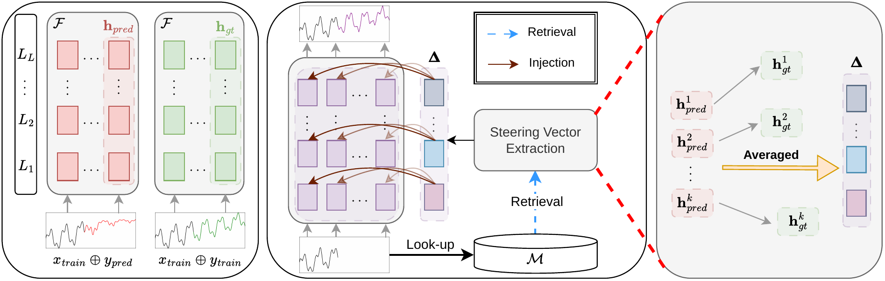

<div align="center">

# SteerCast: Retrieval-Based Latent Steering for Decoder-Only Time Series Forecasting

**Accepted (poster) at NeurIPS 2026**

<!-- TODO: add the paper link once public. -->
[[Paper]](#) &nbsp; [[Project page]](https://davido111200.github.io/SteerCast/) &nbsp; [[Code]](https://github.com/Davido111200/SteerCast)

</div>

<p align="center">
  
</p>

SteerCast improves an already fine-tuned decoder-only forecaster **at inference time, without
updating its parameters**. It builds a database from the training set in which every history window
is stored with a *steering vector*: the difference between the forecaster's hidden states when the
window is continued with the ground truth and when it is continued with the model's own forecast.
At test time SteerCast retrieves the nearest training histories, averages their steering vectors
and injects the result into the hidden states at every autoregressive step.

This repository contains the code for SteerCast on three backbones (Time-MoE, Timer-XL and
TimesFM 2.5), the fine-tuning scripts, the RAF and RAFT baselines, and the scripts used to
produce the tables of the paper. The project page lives in [`docs/`](docs/).

## How it works

1. **Database** (once per dataset, from the training split only). For every univariate training
   window `x` with continuation `y`:
   * key `r(x)`: final-layer hidden states of `x`, mean-pooled over time (Eq. 1);
   * value `Δ = h([x; y]) − h([x; F(x)])`: last-token states of every block under the ground-truth
     and the model-predicted continuation (Eq. 2).
2. **Retrieval**. The query key is compared with the database keys by Euclidean distance and the
   steering vectors of the `k` nearest entries are averaged (Eq. 3).
3. **Injection**. A small tail module edits the output of every transformer block during
   generation, with a cosine gate that weakens the update once the hidden state already points in
   the steering direction and a per-layer normalised update of strength `λ` (Eqs. 4–5).

## Repository layout

```
steercast/                    # the method
  pipeline.py                 #   database construction + steered evaluation
  steering.py                 #   SteeringTail, attach_steering / detach_steering
  vectors.py                  #   steering vector aggregation
  retrieval.py                #   nearest-neighbour retrieval
  backbones/timesfm.py        #   TimesFM 2.5 wrapper
run_steercast_timemoe.py      # SteerCast entry points, one per backbone
run_steercast_timerxl.py
run_steercast_timesfm.py
finetune/                     # fine-tuning of the three backbones
baselines/                    # RAF and RAFT for the three backbones
scripts/                      # reproduction scripts (finetune / steercast / baselines)
time_moe/                     # Time-MoE model and data utilities (from the Time-MoE repository)
tools/convert_monash_tsf.py   # converts Monash .tsf files to CSV
docs/                         # project page (GitHub Pages)
```

## Installation

```bash
conda create -n steercast python=3.10 -y
conda activate steercast
pip install -r requirements.txt
# optional, for faster attention in Time-MoE
pip install flash-attn --no-build-isolation
```

Time-MoE requires `transformers==4.40.1`. TimesFM 2.5 is only needed for the TimesFM experiments:
we use the official PyTorch code at commit `6bd8044`. Its package requires Python ≥ 3.11, so with
the environment above simply put its sources on the path:

```bash
git clone https://github.com/google-research/timesfm.git
git -C timesfm checkout 6bd8044275f8b76cdc9554f2fecccac5f31a156c
export TIMESFM_SRC=$PWD/timesfm/src
```

## Data

Place the ten benchmarks under `./dataset` (or point `DATA_ROOT` elsewhere):

```
dataset/
  ETT-small/{ETTh1,ETTh2,ETTm1,ETTm2}.csv
  exchange_rate/exchange_rate.csv
  weather/weather.csv
  illness/national_illness.csv
  us_births_dataset.csv
  saugeenday_dataset.csv
  sunspot_dataset_without_missing_values.csv
```

* ETT, Exchange, Weather and Illness are the standard long-term forecasting benchmarks distributed
  with [Time-Series-Library](https://github.com/thuml/Time-Series-Library).
* US Births, SaugeenDay and Sunspots (without missing values) come from the
  [Monash forecasting archive](https://forecastingdata.org/). Convert the `.tsf` files with
  `python tools/convert_monash_tsf.py dataset/us_births_dataset.tsf` (and likewise for the others).

ETT uses the 12/4/4-month split; all other datasets use a 70/10/20 chronological split. Every split
is standardised with training statistics and every channel is forecast independently.

## Quick start

```bash
# 1) fine-tune the backbone on the target dataset (here Time-MoE on ETTh1)
bash scripts/finetune/timemoe.sh ETTh1

# 2) SteerCast: build the database from the training split, then evaluate on the test split
python run_steercast_timemoe.py \
    -m checkpoints/timemoe/ETTh1 -d dataset/ETT-small/ETTh1.csv --data ETTh1 \
    -c 512 -p 96 -b 512 --k 1 --lam 0.01
```

The database is written to `./cache/<backbone>/<data>/<seq_len>_<db_pred_len>/<checkpoint>/` and
reused by later runs. Metrics are printed and saved as JSON under `./results/`.

### Main options

| Option | Meaning | Default |
|---|---|---|
| `--k` | number of retrieved neighbours | 1 |
| `--lam` | steering strength λ (`--lam 0` gives the fine-tuned model) | 0.01 |
| `--beta` | update rule: 0 = plain norm-preserving update, 1 = cosine-gated update of Eqs. 4–5, in between = interpolation | 0 |
| `--gate_b --gate_m --gate_p` | gate floor *b*, margin *m*, power *p* | 0.1, 0.1, 1.25 |
| `--retrieval` | `euclidean` or `cosine` | euclidean |
| `--whiten` | whiten the steering vector by the spread of `h_pred` over the neighbours | 1 for Time-MoE, 0 otherwise |
| `--pool_number` | the database uses the last `pool_number` time steps of the training split | 10000 |
| `--db_pred_len` | continuation length used to build the database (reuse one database across horizons) | `--pred_len` |
| `--db_buffer` | drop the last N training windows per channel (strict temporal isolation) | 0 |
| `--split` | `test`, or `val` for hyper-parameter selection | test |

## Reproducing the paper

All scripts read `DATA_ROOT`, `CKPT_ROOT`, `CACHE_ROOT` and `RESULTS_ROOT` (defaults `./dataset`,
`./checkpoints`, `./cache`, `./results`), take a protocol and an optional list of datasets, and
contain the per-dataset hyper-parameters.

```bash
# fine-tuning (FT)
bash scripts/finetune/timemoe.sh
bash scripts/finetune/timerxl.sh
bash scripts/finetune/timesfm.sh fixed        # TimesFM is fine-tuned per horizon

# SteerCast: Table 2 (fixed look-back 512) and Table 1 (look-back 512/1024/2048/3072)
bash scripts/steercast/timemoe.sh fixed
bash scripts/steercast/timemoe.sh various
bash scripts/steercast/timerxl.sh fixed  ETTh1 ETTh2      # any subset of datasets
bash scripts/steercast/timesfm.sh various

# baselines (also raf_timerxl / raf_timesfm / raft_timerxl / raft_timesfm)
bash scripts/baselines/ft_timemoe.sh fixed
bash scripts/baselines/raf_timemoe.sh fixed
bash scripts/baselines/raft_timemoe.sh fixed
LAMBDA=0 bash scripts/steercast/timerxl.sh fixed      # FT for Timer-XL (same for TimesFM)
```

In the **fixed** protocol a single database, built for the shortest horizon, is reused for all
horizons; in the **various** protocol a database is built for every look-back/horizon pair. TimesFM
is fine-tuned per horizon, so it always uses one database per checkpoint.

### Notes

* **Retrieval is done once per test mini-batch**, as in the experiments of the paper: Time-MoE
  matches the mini-batch as a whole (distance `‖Q − r‖_F` over the batch of keys `Q`), Timer-XL and
  TimesFM match its first window, and the database of the first window's channel is used. Results
  therefore depend on `--batch_size`; the scripts use the batch sizes of the paper. Use `-b 1` for
  strictly per-window retrieval.
* Databases are large (several GB per dataset for Time-MoE, see Table 5 of the paper). Building one
  takes a single pass of the forecaster over the training split.
* `--fast_retrieval` computes Euclidean distances with one matrix product instead of one norm per
  entry; it is much faster on large databases but may reorder near-ties.

## Citation

```bibtex
@inproceedings{steercast2026,
  title     = {SteerCast: Retrieval-Based Latent Steering for Decoder-Only Time Series Forecasting},
  author    = {Van Dai Do, Huu Hiep Nguyen, Minh Hoang Nguyen, Hung Le},
  booktitle = {Advances in Neural Information Processing Systems (NeurIPS)},
  year      = {2026}
}
```
<!-- TODO: replace the author field once the paper is de-anonymised. -->

## Acknowledgements

This code builds on [Time-MoE](https://github.com/Time-MoE/Time-MoE) (model and data utilities),
[Timer-XL](https://github.com/thuml/Timer-XL), [TimesFM](https://github.com/google-research/timesfm),
[RAFT](https://proceedings.mlr.press/v267/han25d.html), [Time-Series-Library](https://github.com/thuml/Time-Series-Library)
and the [Monash forecasting archive](https://forecastingdata.org/). We thank the authors for
releasing their code and data.

## License

Released under the Apache 2.0 License (see [LICENSE](LICENSE))
